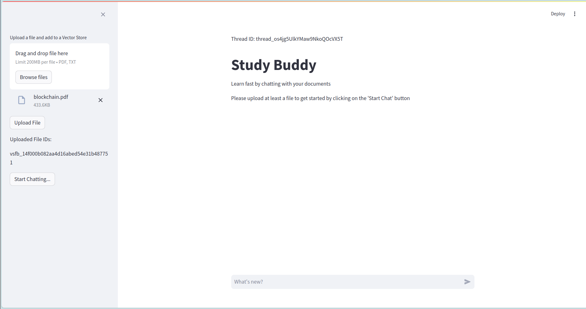

# Study Buddy

This project demonstrates the integration of OpenAI's Assistant API with file search tools and a user interface built using Streamlit. The goal is to create an interactive and efficient application that allows users to search for files and retrieve relevant information using OpenAI's powerful language models.

## Table of Contents

- [Features](#features)
- [Installation](#installation)
- [Usage](#usage)
- [Configuration](#configuration)
- [Project Structure](#project-structure)
- [Contributing](#contributing)
- [License](#license)

## Features

- **OpenAI Assistant API Integration**: Leverage the capabilities of OpenAI's language models to process and interpret file contents.
- **File Search**: Upload files to the application and search for specific information within the files.
- **Streamlit User Interface**: A simple and interactive UI for users to interact with the application.

## Installation

To get started with this project, follow these steps:

1. **Clone the repository**:
    ```bash
    git clone https://github.com/tdkhoavn/study-buddy.git
    cd tudy-buddy
    ```

2. **Create and activate a virtual environment**:
    ```bash
    python -m venv venv
    source venv/bin/activate
    ```

3. **Install the required dependencies**:
    ```bash
    pip install -r requirements.txt
    ```
4. **Configure the OpenAI API key**:
    Create a `.env` file in the root directory of the project and add the following line:
    ```bash
    OPENAI_API_KEY=<YOUR_API_KEY>
    ```
   
## Usage

To run the application, use the following command:

```bash
streamlit run main.py
```

### User Interface

